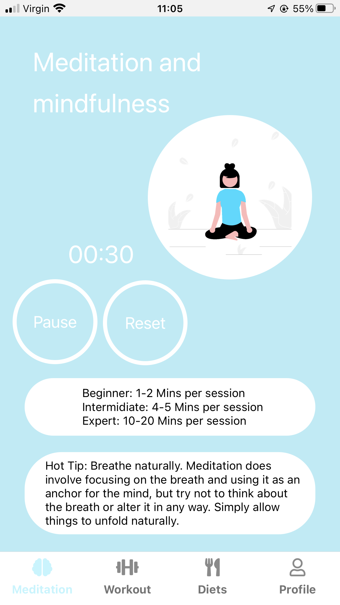
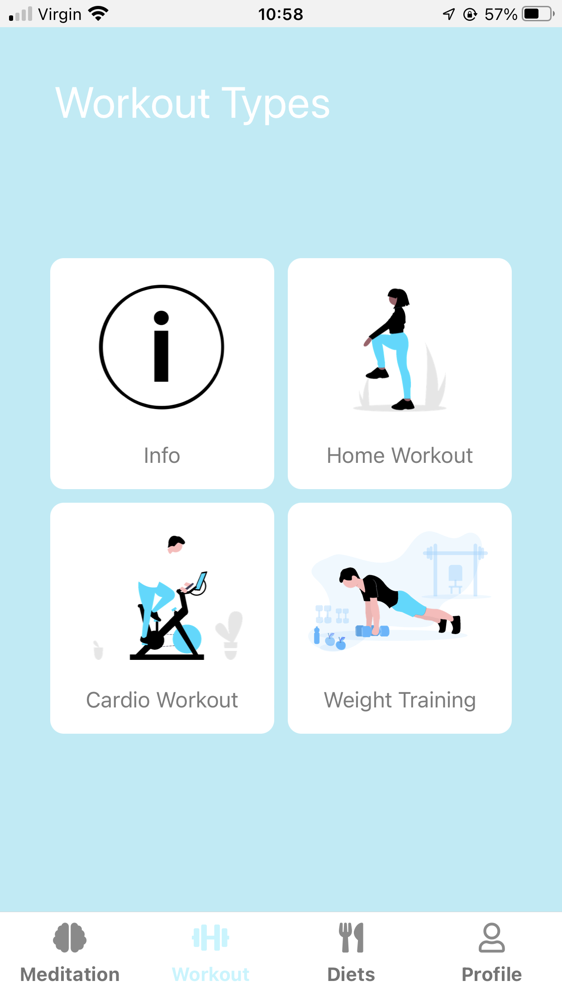
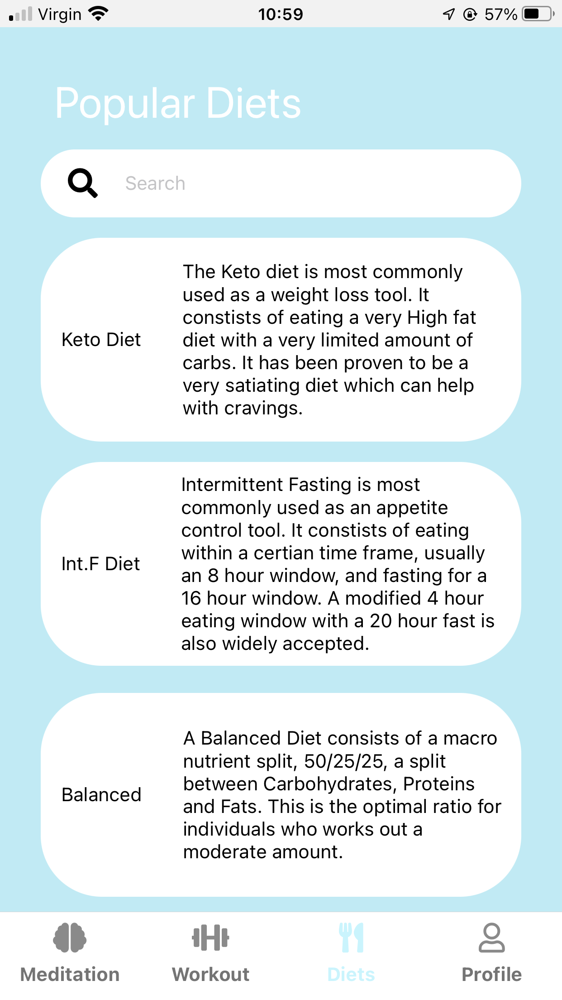
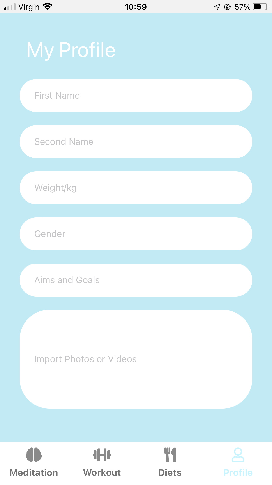

# GetRight3
This is the front end development of a health and wellness application which has been developed through the implementation of UI/UX standards.

The packages downloaded and applied for this project include:

react-native-vector-icons

npm i react-native-vector-items

//

react-navigation 

npm install @react-navigation/native

//

react-navigation-bottoms-tabs

npm install @react-navigation/bottom-tabs

//
 
react-navigation/stack

npm install@react-navigation/stack

 

